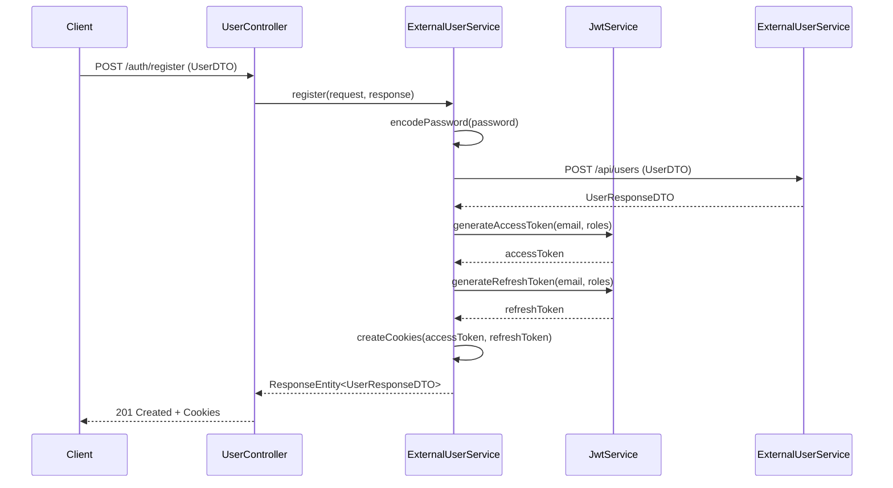
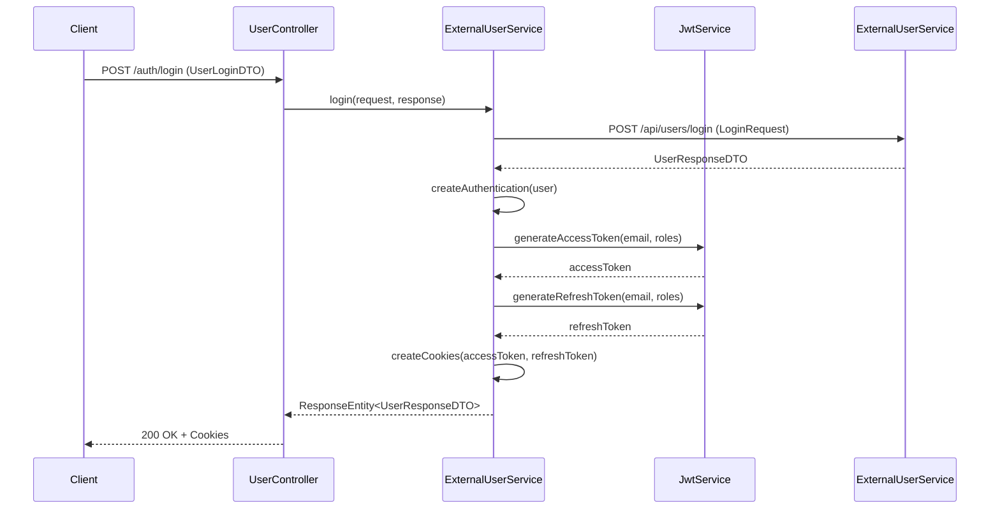
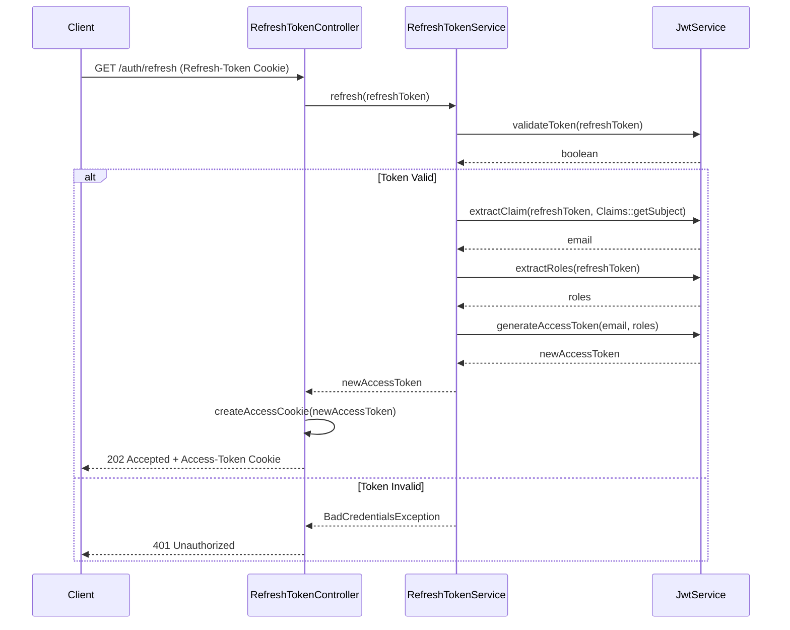
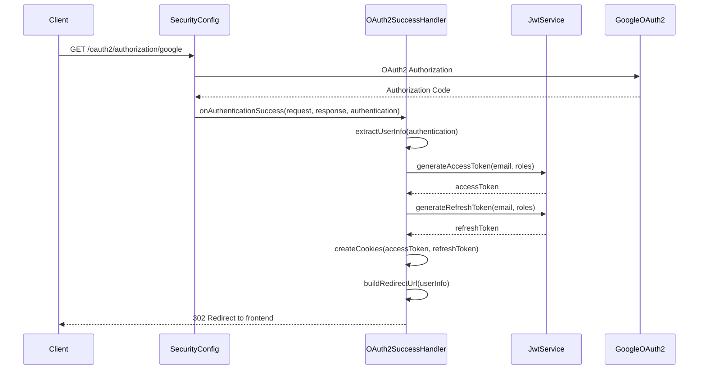

# Authentication Service Documentation

## Overview

This is a comprehensive Spring Boot-based authentication service that provides JWT-based authentication and authorization with support for both traditional username/password login and OAuth2 Google authentication. The service is designed as a microservice that communicates with a separate user service for user management.

## Architecture Overview

The authentication service follows a layered architecture pattern with clear separation of concerns:

### Core Components

1. **Controllers Layer** - REST API endpoints
2. **Services Layer** - Business logic implementation
3. **Configuration Layer** - Security and application configuration
4. **DTOs** - Data Transfer Objects for API communication
5. **Models** - Domain entities
6. **Exceptions** - Custom exception handling

## Key Features

- **JWT Authentication** - Secure token-based authentication with access and refresh tokens
- **OAuth2 Integration** - Google OAuth2 authentication support
- **Cookie-based Token Storage** - Secure HTTP-only cookies for token storage
- **Role-based Authorization** - Support for multiple user roles
- **Microservice Architecture** - Integration with external user service
- **Comprehensive Error Handling** - Proper HTTP status codes and error responses
- **Security Best Practices** - BCrypt password encoding, secure token validation

## Authentication Flows

### 1. User Registration Flow



### 2. User Login Flow



### 3. Token Refresh Flow



### 4. OAuth2 Google Login Flow



## API Endpoints

### Authentication Endpoints

| Endpoint | Method | Description | Request Body | Response |
|----------|--------|-------------|--------------|----------|
| `/auth/register` | POST | Register new user | UserDTO | UserResponseDTO + Cookies |
| `/auth/login` | POST | User login | UserLoginDTO | UserResponseDTO + Cookies |
| `/auth/refresh` | GET | Refresh access token | Cookie: Refresh-Token | New Access-Token Cookie |
| `/auth/clear` | GET | Clear all cookies | None | 200 OK + Expired Cookies |
| `/auth/clear-access` | GET | Clear access token only | None | 200 OK + Expired Access Cookie |

### OAuth2 Endpoints

| Endpoint | Method | Description |
|----------|--------|-------------|
| `/oauth2/authorization/google` | GET | Initiate Google OAuth2 login |
| `/login/oauth2/code/google` | GET | OAuth2 callback (handled by Spring) |

### Health and Testing Endpoints

| Endpoint | Method | Description |
|----------|--------|-------------|
| `/auth/test/public` | GET | Public test endpoint |
| `/auth/test/health` | GET | Health check endpoint |

## Data Models

### UserDTO
```json
{
  "firstName": "string",
  "lastName": "string", 
  "email": "string",
  "password": "string",
  "roles": ["string"]
}
```

### UserLoginDTO
```json
{
  "email": "string",
  "password": "string",
  "keepMeLoggedIn": boolean
}
```

### UserResponseDTO
```json
{
  "id": "string",
  "email": "string",
  "firstName": "string",
  "lastName": "string",
  "roles": ["string"]
}
```

## Security Configuration

### JWT Configuration
- **Access Token Expiration**: 15 minutes
- **Refresh Token Expiration**: 7 days
- **Token Secret**: Base64 encoded secret key
- **Algorithm**: HMAC-SHA256

### Cookie Configuration
- **HttpOnly**: true (prevents XSS attacks)
- **Secure**: true (HTTPS only)
- **SameSite**: Strict (prevents CSRF attacks)
- **Path**: "/" (available across the application)

### OAuth2 Configuration
- **Provider**: Google
- **Scopes**: openid, profile, email
- **Redirect URI**: http://localhost:8080/login/oauth2/code/google

## Error Handling

The service provides comprehensive error handling with proper HTTP status codes:

| Error Type | HTTP Status | Description |
|------------|-------------|-------------|
| Validation Error | 400 | Invalid request data |
| Authentication Failed | 401 | Invalid credentials |
| User Not Found | 404 | User doesn't exist |
| User Already Exists | 409 | Duplicate registration |
| Invalid Token | 401 | Malformed JWT token |
| Token Expired | 401 | Expired JWT token |
| Internal Server Error | 500 | Unexpected server error |

## Configuration

### Application Properties
```properties
# Server Configuration
server.port=8082
spring.application.name=auth-service

# JWT Configuration
jwt.secret=your-256-bit-secret-key-here
spring.security.oauth2.resourceserver.jwt.secret=your-256-bit-secret-key-here

# OAuth2 Configuration
spring.security.oauth2.client.registration.google.client-id=your-client-id
spring.security.oauth2.client.registration.google.client-secret=your-client-secret
spring.security.oauth2.client.registration.google.scope=openid,profile,email
spring.security.oauth2.client.registration.google.redirect-uri=http://localhost:8080/login/oauth2/code/google

# Discovery Service
eureka.client.service-url.defaultZone=http://localhost:8761/eureka
```

## Deployment

### Docker
```dockerfile
FROM openjdk:17-jdk-slim
COPY target/auth-service-0.0.1-SNAPSHOT.jar app.jar
EXPOSE 8082
ENTRYPOINT ["java", "-jar", "/app.jar"]
```

### Environment Variables
```bash
export JWT_SECRET=your-secure-secret-key
export SERVER_PORT=8082
export GOOGLE_CLIENT_ID=your-google-client-id
export GOOGLE_CLIENT_SECRET=your-google-client-secret
```

## Using the Diagrams

### Sequence Diagram (`auth-service-sequence-diagram.puml`)
This diagram shows the detailed interaction flow between components for all major authentication scenarios:
- User registration
- User login
- Token refresh
- Protected resource access
- OAuth2 Google login
- Logout

To view this diagram:
1. Use a PlantUML renderer (VS Code extension, online editor, or IDE plugin)
2. Copy the content of `auth-service-sequence-diagram.puml`
3. The diagram will show the complete authentication flows with timing and decision points

### Architecture Diagram (`auth-service-architecture-diagram.puml`)
This diagram provides a high-level view of the system architecture:
- Shows all major components and their relationships
- Illustrates external service dependencies
- Displays security components and their integration

### Class Diagram (`auth-service-class-diagram.puml`)
This diagram shows the detailed class structure:
- All major classes with their attributes and methods
- Relationships between classes
- Inheritance and dependency relationships

## Best Practices

### Security
1. **Token Storage**: Always use HttpOnly cookies for token storage
2. **Password Security**: Use BCrypt with strength 12 for password hashing
3. **Token Expiration**: Keep access tokens short-lived (15 minutes)
4. **Refresh Token Rotation**: Implement secure refresh token handling
5. **Input Validation**: Validate all user inputs
6. **Error Handling**: Don't expose sensitive information in error messages

### Performance
1. **Token Validation**: Cache validated tokens when possible
2. **Database Connections**: Use connection pooling
3. **Logging**: Use appropriate log levels and avoid logging sensitive data
4. **Monitoring**: Implement health checks and metrics

### Maintainability
1. **Separation of Concerns**: Keep controllers thin, business logic in services
2. **Exception Handling**: Use centralized exception handling
3. **Configuration**: Externalize configuration properties
4. **Testing**: Maintain comprehensive test coverage

## Troubleshooting

### Common Issues

1. **Token Expired**: Check if access token is within 15-minute window
2. **Invalid Token**: Verify JWT secret key configuration
3. **OAuth2 Issues**: Check Google OAuth2 client configuration
4. **Cookie Issues**: Ensure proper cookie domain and path settings
5. **CORS Issues**: Configure CORS for frontend integration

### Debugging

Enable debug logging:
```properties
logging.level.org.springframework.security=DEBUG
logging.level.org.springframework.security.oauth2=DEBUG
logging.level.com.example.auth_service=DEBUG
```

## Contributing

1. Follow the existing code structure and patterns
2. Add comprehensive tests for new features
3. Update documentation for any API changes
4. Follow security best practices
5. Use meaningful commit messages

## License

This project is licensed under the MIT License. 